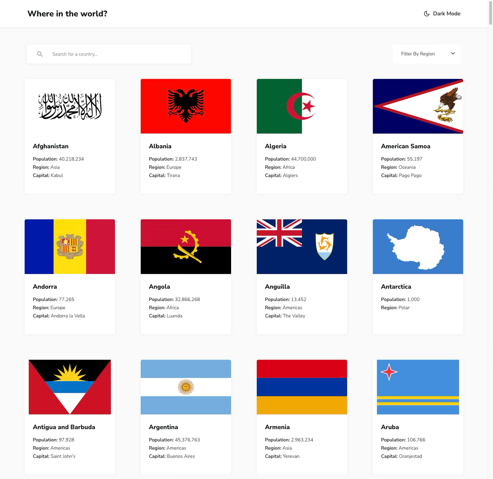
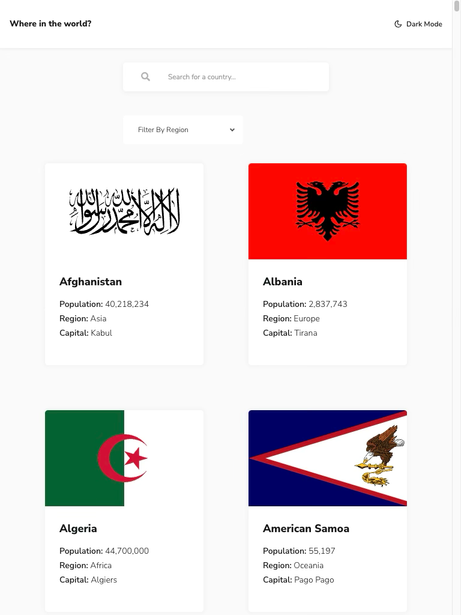
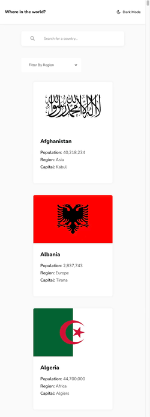

# 🌍 REST Countries API with Theme Switcher

A responsive web app that displays country data from the REST Countries API. Users can filter by region, search by name, and toggle between dark and light themes.

🔗 **Live Demo**: [https://rest-countries-api-with-color-theme-switcher-teal.vercel.app/](https://rest-countries-api-with-color-theme-switcher-teal.vercel.app/)

---

## 🧱 Tech Stack

- Vue.js  
- REST Countries API  
- CSS Variables for theming  
- JavaScript (ES6)

---

## 📱 Responsive Previews

| Desktop                     | Tablet                     | Mobile                     |
|----------------------------|----------------------------|---------------------------|
|     |      |      |

---

## ✨ Features

- Browse country data with flag, population, region, and capital
- Filter countries by region
- Search countries by name
- Toggle between dark and light mode
- Responsive design for all screen sizes

---

## 🛠️ Project Setup

```bash
yarn install
```

### Compiles and hot-reloads for development

```bash
yarn serve
```

### Compiles and minifies for production

```bash
yarn build
```

### Lints and fixes files

```bash
yarn lint
```

### Customize configuration

See [Configuration Reference](https://cli.vuejs.org/config/).
